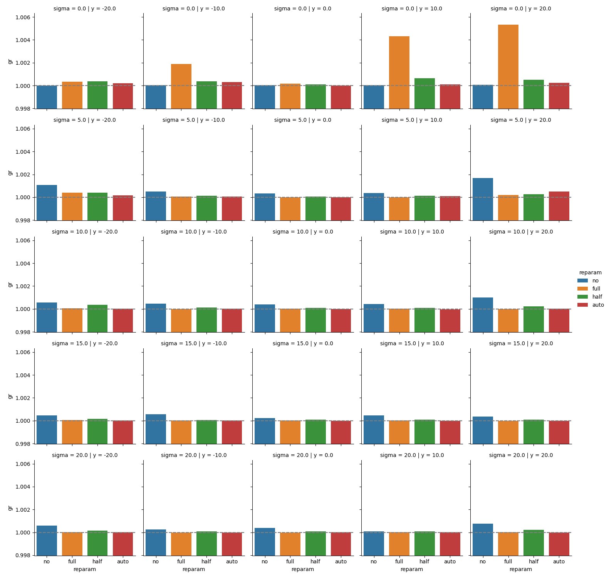

# Meta-learning Optimal Reparameterisation of Probabilistic Programs

## Introduction
Markov Chain Monte Carlo (MCMC) has been one of successful tools in Bayesian inferences, which gaurantees convergence to exact target statistics.
The main concern in MCMC is to sample in high dimensional spaces, which grow exponentially on their dimensions. Hamiltonian Monte Carlo (HMC) is a widely used approach for mitigating this challenge from high dimensionality. It does so by using gradients of target distributions to explore the spaces. 
However, the convergence of HMC can still be slow or even fail if a target density has poor geometric properties such as having multiple modes or drastic changes in scale.

Reparameterisation, which transforms the target distribution with a bijective function, is one of the most frequently-uesd methods to change the poor landscape of the target distribution into an easier-to-explore landscape. However, 
since an appropriate bijective function for reparameterisation is specific to the target distribution, finding an effective bijective map manually is non-trivial and requires deep understanding of the target distribution. 

By leveraging the benefits of probabilistic programming, which treats probabilistic models as programs to which methods in programming analysis can be applicable, some researchers proposed a method that constructs a parameterised bijective function compatible to the target distribution and learns appropriate parameterswhich make the function an effective reparmetersation.
However, this method requires the learning of the parameters from scratch for every new model, and this makes the method inappropriate in particular for model finding. 

In our research, instead of finding a reparameterisation for each given model, we try to meta-learn a method for reparameterisation itself. That is, we try to learn a function that gets a probabilistic model (in forms of a probabilistic program) and outputs a proper bijective function for the reparameterisation of themodel. The learned method in our approach works as follows. It first parses a given probabilistic program representing a probabilistic model, and constructs a graph representation of the model. Then, it runs a GNN on the graph representation to construct a bijective function that reparamterises the model. The meta-learning part of our approach corresponds to the learning of the parameters of the GNN here. We train this GNN by optimizing a loss over a wide range of models where the loss measures the smoothness of the landscapes of the reparamterized versions of these models.

## Preliminary
- Hamiltonian Monte Carlo (HMC)

Hamiltonian Monte Carlo (HMC) is an MCMC method which proposes the next sample based on a simulation of Hamiltonian dynamics.
To sample from a target unnormalised distribution $P(x)$, HMC introduces a fictional Hamiltonian system with auxiliary variables $p$, which has the same dimension as $x$ and represents the momentum in the Hamiltonian dynamics. The Hamiltonian in the system is written as follows: $H(x,p) = -\mathit{ln}(P(x)) + \frac{1}{2}p^TMp$, and the target distribution becomes proportional to $e^{-H(x,p)}$.
Then, the next proposal is chosen by simulating of Hamiltonian dynamics until fixed time $t$ starting from the current position with the momentum sampled from $Normal(0,M)$. The simulation is done by numerically calculating Hamiltonian equations with a leapfrog integrator. Finally, accept the next proposal with Metropolis acceptance ratio. Thanks to time reversible and volume preserving properties of the leapfrog integrator and Hamiltonian dynamics, the ratio is easy to calculate and likely to be close to 1. <br>
It is well-known that HMC works well in high-dimensional spaces, and there are some proofs of fast convergences of HMC in specific settings of high-dimensional distributions. That's why HMC becomes one of dominent tools for MCMC sampling in continuous spaces. However, HMC doesn't work well when a target distribution has a poor geometry such as multimodality, stiff changes of scales in distribution, no matter how precise the simulation is.

- Reparameterisation

Reparameterisation in probabilistic model domain is to transform a distribution with bijective functions. For a continuous distribution, probability density of reparameterised distributions can be calculated by inverse functions of used bijective functions and its' Jacovians by chage of variable law. Commonly-used reparameterisations usually have a simple analytic solution: for example, Normal distribution can be reparameterised as follows:
```math
z \sim N(\mu, \sigma),
```
```math
z = \sigma u + \mu, \, u \sim N(0,1).
```
Reparameterisation can be used to fix a poor geometry of distributions so that MCMC sampling including HMC work well on the reparemterisaed distributions. Neal's funnel is a famous toy example which shows how reparameterisation mitigate a problem of a poor geometry:
```math
z \sim N(0,1),
```
```math
x \sim N(0, e^z).
```
The distribution above shows funnel-shaped probabilistic density as belows.

picture

We can see that the density in Neal's funnel has the broad body and the narrow neck. HMC can't explore well on this kinds of shapes because of stiff changes of scale in the density. A large step size of an integrator works well in the body but not in the neck, and a small step size will work in the neck but not in the body. However, Neal's funnel can be easily reparameterised into independant Gaussians as belows:
```math
z \sim N(0,1),
```
```math
x = e^z u, \, u \sim N(0,1).
```
Then, Instead of sampling $X,Y$ directly, we can make a sample of $X,Y$ by sampling from $X,U$ and transfroms the values with the function written above.

We can see that the reparmeterisation in Neal's funnel disconnect direct relationship between $X$ and $Y$. This kinds of reparameterisation is called Non-centred, while a centered reparameterisation, which includes identity functions, remains a direct connection. A non-centred reparameterisation makes density calculation simpler, but it cannot be a master key to fix a poor geometry becuase there exists indirect dependancies between variables usually occurred by observations. We should chose carefully whether we use non-centred or centred reparameterisation according to a distribution landscape of a model.

- Probabilistic programming

Probabilistic programming is a pradigm to use a programming language (called a probabilistic programming language, PPL) to express a broad range of probabilistic models and do inference on those models automatically by using technics in programming language theory. Usually, a PPL consists of two parts; a model and an inference. In the model part, users can declare random variables with certain distributions and use them in common commands in programming languages including assignments and control statements. Therefore, the PPL can express complex models such as a time-series model or a hierarchical model. Moreoever, observations can be placed on certain random variables. In the inference part, the user can do inference on the model without caring details. From basic operations like sampling and density calculation, the user can construct more complex inferences; PPLs usually provide presets for popular inferences such as MCMC, VI, MAP, and etc.
Using PPLs, Researchers in the field of probabilistic inference can test their ideas without writing code for basic calculations, which is error-prone and time-consuming.

- Graph Neural Network (GNN)

A graph neural network (GNN) is a neural network working on a graph structure. an usual GNN has a form of a message-passing algorithm where processing of messages is done by neural networks. A message-passing layer for each node $u$ can be expressed as belows:

$$ h'_u = \phi(\bigoplus_{v \in N_u} \psi(h_u, h_v, e_{uv}))$$

where $N_u$ is the neighbourhood of $u$, and $\bigoplus$ is a permutaion-invariant aggregation function, and $\phi, \psi$ are neural networks and $h_{-}, e_{-}$ are current features for nodes and edges. Most GNNs are contructed with several message-passing layers and use features in the final layers to predict the characteristics of graph data.

GNNs are widely used in Chemistry, Biology, Social science, where graph structures are naturally emerged in data.


## Related Work
- Neural Transport HMC (NeuTra HMC) [[Hoffman et al., 2019]](https://arxiv.org/abs/1903.03704)

The paper introduces NeuTra HMC, a technique that enhances the performance of HMC in sampling from challenging posterior distributions. By incorporating inverse autoregressive flows (IAF) and a neural variational inference technique, NeuTra HMC addresses unfavorable geometry in the posterior, allowing for faster convergence and improved asymptotic effective sample sizes. The approach builds upon previous work on transport maps, adapting more powerful and scalable IAF maps to train variational autoencoders (VAEs).

- Variationally Inferred Parameterisation (VIP) [[Gorinova et al., 2020]](http://proceedings.mlr.press/v119/gorinova20a/gorinova20a.pdf)

The VIP algorithm efficiently searches the space of reparameterisation through the gradient-based optimisation of a differentiable variational objective. It can be also used as a pre-processing step for other inference algorithms. <br>
The paper focuses on the parameterisation applied to normally distributed (or any location-scale family) random variables $z \sim N(\mu, \sigma)$, resulting in
```math
\hat{z} \sim N(\lambda \mu, \sigma^\lambda),
```
```math
z = \mu + \sigma^{1-\lambda} (\hat{z} - \lambda \mu).
```
This is a continuous relaxation between the non-centred parameterisation (as a special case $\lambda=0$) and the centred parameterisation (as a special case $\lambda=1$). VIP finds the reparameterised model with $\lambda$ that mostly approximates a diagonal-normal. This parameterisation can be applied to any random variables in the location-scale family.

## Method
1. Generate models to train. <br>
Using a simply defined grammar of probabilistic programming language, we automatically generated various models to create a training dataset.

2. Convert models into computation graphs. <br>
We converted the generated models into computation graphs. The resulting computation graphs are simliar to the Bayesian networks, but constants are also represented as nodes, and deterministic operators (e.g., addition, exponential) are also represented as edges, and all edges between random variables are undirected.

3. Construct a GNN on the computation graphs. <br>
For a hyperparameter $d$, each constant node with constant $c$ was initialised by a $d$-dimensional feature vector $[c^0,\, c^1,\, \ldots,\, c^{d-1}]$, and each random variable node was initialised by a $d$-dimensional zero feature vector. Each edge has a type given by its parameterisation (e.g., location/scale of Normal distribution) or deterministic operator (e.g., addition, exponential). Every edge has a $d \times d$ learnable matrix, and edges with the same type share their matrices. The message passing algorithm of the GNN at step $l+1$ is defined by
```math
v^{(l+1)} = \phi^{(l)} \left( \sum_{u \in N(v)} A_{(u, v)} u^{(l)} \right)
```
where each of $u, v$ is a node, and $v^{(l)}$ is the feature vector of $v$ at step $l$, and $N(v)$ is a set of neighbors of $v$, and $A_{(u, v)}$ is the learnable matrix of the edge $(u, v)$, and $\phi^{(l)}$ is a learnable function constructed by fully connected layers.

4. Train GNN with variational objectives. <br>
If a random variable node $v$ is in the location-scale family, we use its GNN output node feature $v^{(L)} \in [0, 1]$ as $\lambda$ in VIP to reparameterise $v$ in the model. As in the VIP, we trained the GNN to minimise the ELBO loss computed by the diagonal normal guide and the reparameterised model with $\lambda$'s.

5. Run HMC on the reparameterised models. <br>
Once we train the GNN, we can run the forward pass of GNN and obtain $\lambda$ values of new models that are not included in the training dataset. With these $\lambda$'s, we reparameterised the model and then applied HMC on top of it.

## Experiments
For the training, we randomly generated 1,000 Neal's funnel models modified with additional observations:
```math
z \sim N(0, 1);
```
```math
x \sim N(0, e^z);
```
```math
y \overset{obs}{\sim} N(x, \sigma)
```
where $y \in [-20, 20]$ and $\sigma \in [0.1, 20]$. As $y$ moves away from $0$ and $\sigma$ approaches $0$, the posterior takes on a different shape from the original Neal's funnel. For the test, we obtained $\lambda$ by training the GNN on the Neal's funnel models with observations with $y \in \{-20, -10, 0, 10, 20\}$ and $\sigma \in \{0.1, 5.075, 10.05, 15.025, 20\}$, and then applied HMC on the reparameterised model with $\lambda$. For HMC, we used the No-U-Turn Sampler (NUTS), and we took 1,000 initial warm-up steps to sample 20 chains each producing 10,000 samples.

- Comparison with VIP

The following figures show the $\lambda$ values learned using VIP and our meta-learning approach with respect to $y$ and $\sigma$. In our approach, we took 1,000 additional warm-up steps where the GNN was frozen and only the diagonal normal guide was trained.

|     |     |
| --- | --- |
| VIP |  |
| Ours |  |

- Comparison by effective sample size (ESS) and Gelman-Rubin (GR) diagnostics

The following figures show the ESS and the GR diagnostics of the HMC samples in 4 different approaches. "No" corresponds to the centred parameterisation $(\lambda = 1)$, "full" corresponds to the non-centred parameterisation $(\lambda = 0)$, "half" corresponds to the parameterisation with $\lambda = 0.5$, and "auto" exhibits our approach with meta-learned $\lambda$.




## Discussion
- Implicit GNN

It is hard to choose the number of steps $L$ in our GNN.
If it's too low, signals from observations cannot reach the dependent variables. If it's too high, GNN can fail to learn reparameterisations because of oversmoothing. Moreover, we cannot guarantee that inputs with the same substructure will have the same sub-results for that substructure, because $L$ will vary among models.
To solve this obstacle, we can try Implicit GNN which uses fixed points of the update function as output instead of the fixed iterations of updates. Implicit GNN can catch long range dependence without causing oversmoothing.

- Legitimacy of loss function

During experiments, we saw that learning parameters in reparameterisation was disturbed by initialisations of guides.
It is possible that the GNN learns wrong reparameterisations if a guide fails to converge to the optimal shape; GNN will learn the optimal reparameterisation for the wrong guide.
Instead of using VI-based indirect loss, we can use proper loss from model directly.
Several theoretical results of HMC shows strong-concavity and smoothness of model's log density is important in a speed of convergence. If we define relaxations of smoothness and concavity and construct estimators, we may use these estimators to define a loss directly calculated from an input model.

- Meta-learning reparameterisation with more flexible transformations, such as inverse autoregressive flows (IAF)

Both VIP and our approach use the restricted transformation for the reparameterisation. The reparameterisation only works for the location-scale family random variables. Also, it may not have sufficient expressive power to transform the diagonal normal distribution into various complex shapes of the posterior. If we can meta-learn more flexible bijective transformations like IAF using our method, we may learn reparameterisations for much broader range of complex distributions which is applicable to any family of random variables.
